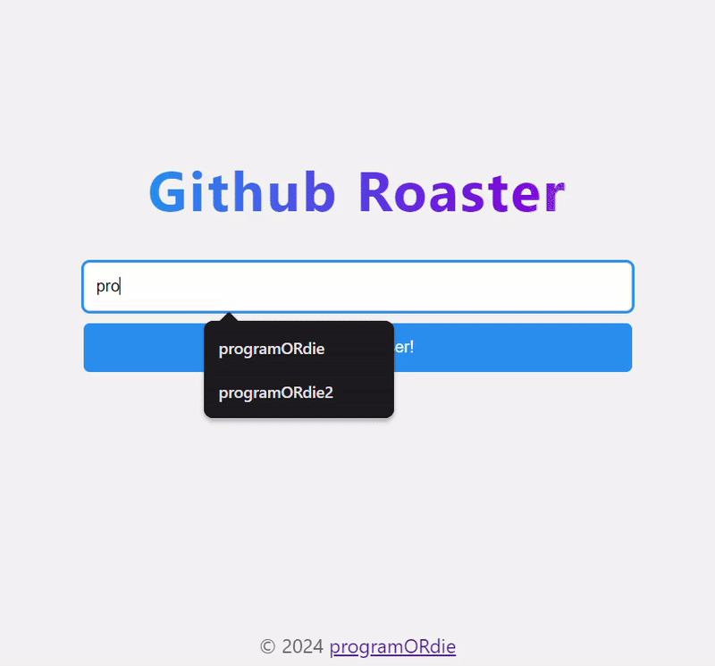

# AI GitHub user roaster
This is a cool project that roasts GitHub users by fetching their public profile and some of their repositories and passing them to an LLM (llama 3.1).

## Demo
[⭐ Check it out here!](https://github-roaster.programordie.workers.dev/)

## Run locally
If you want to try this on your own machine, you can run this on your localhost:
 - Download this repo or clone the code with git.
 - Open the folder where you saved the code.
 - [Install Wrangler if you haven't done that yet](https://developers.cloudflare.com/workers/wrangler/install-and-update/).
 - Create a new project with ``npm create cloudflare@latest``. If prompted, say yes to TypeScript.
 - Copy the code of the download ``/src`` folder to the new one.
 - Run the code with ``npx wrangler dev``.
 - Open the URL in your browser.
 - If you want, you can deploy it to cloudflare with ``npx wrangler deploy``

### Thats it!